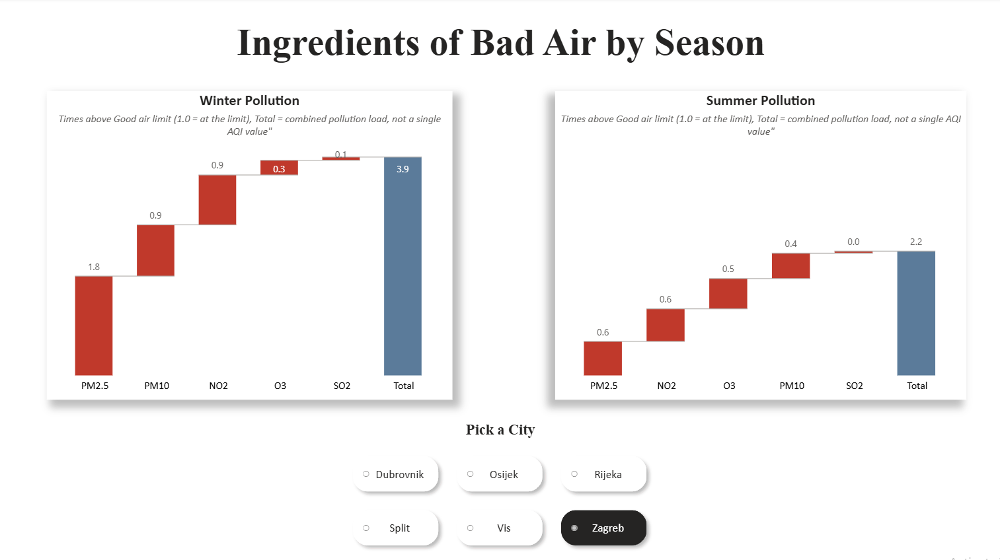
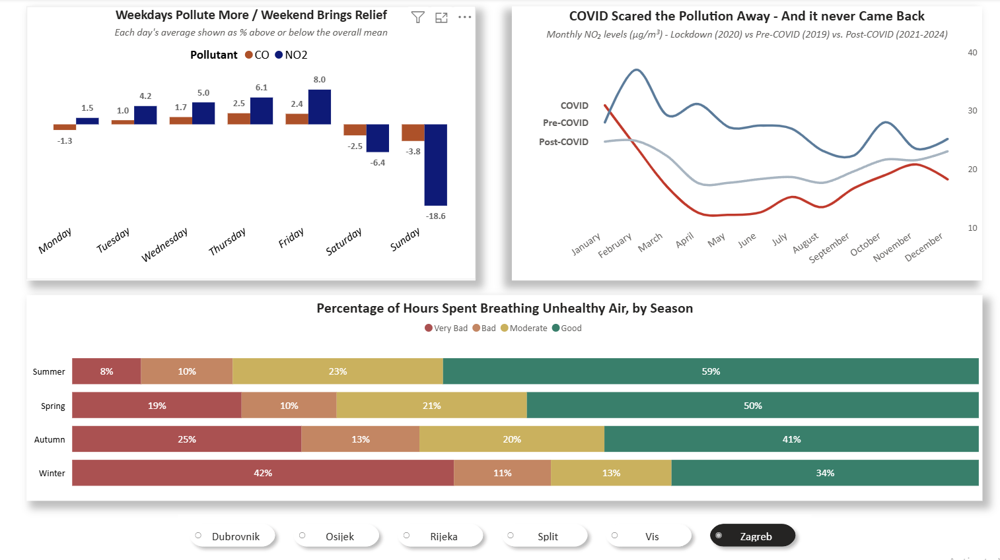
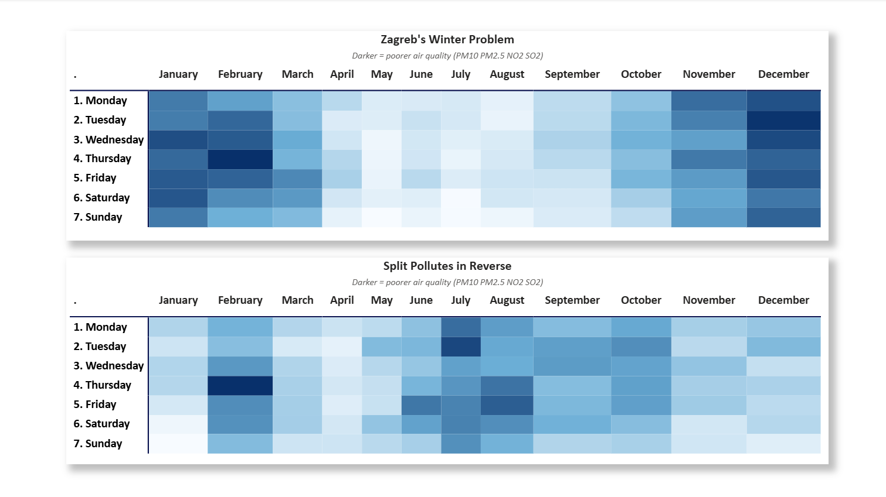
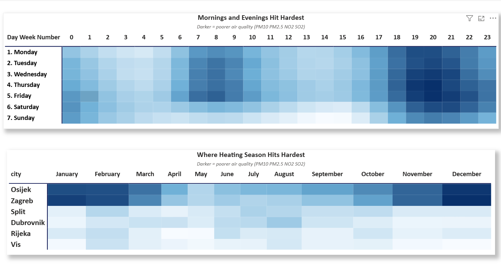
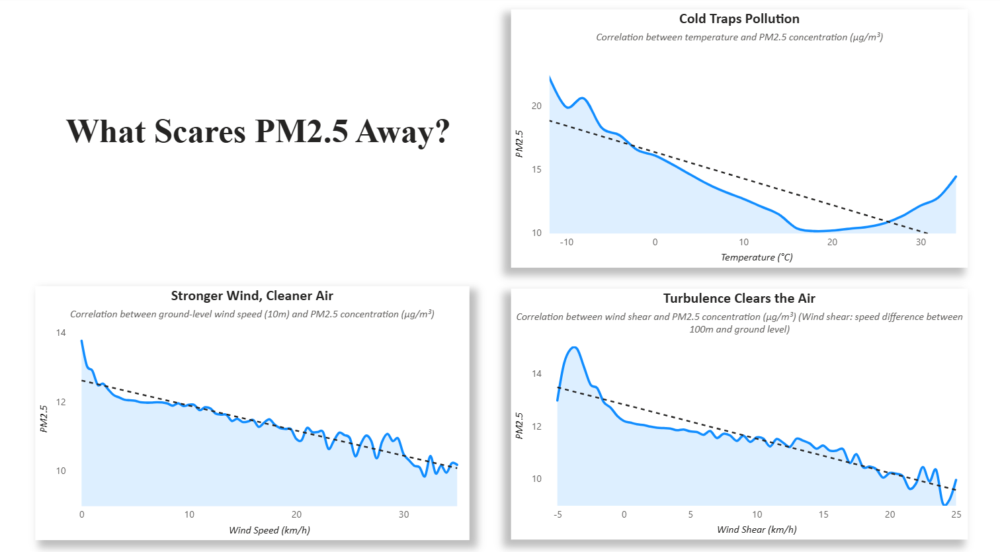
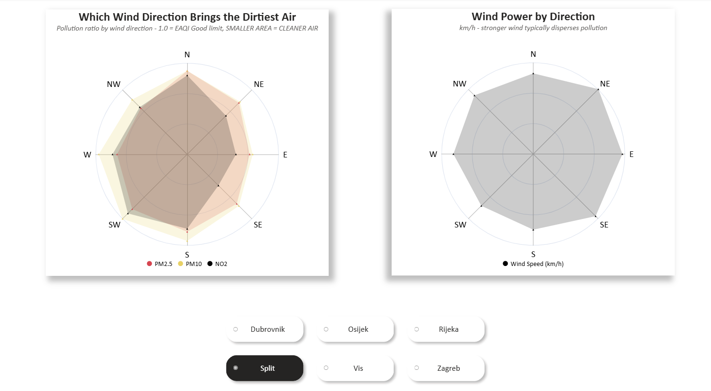
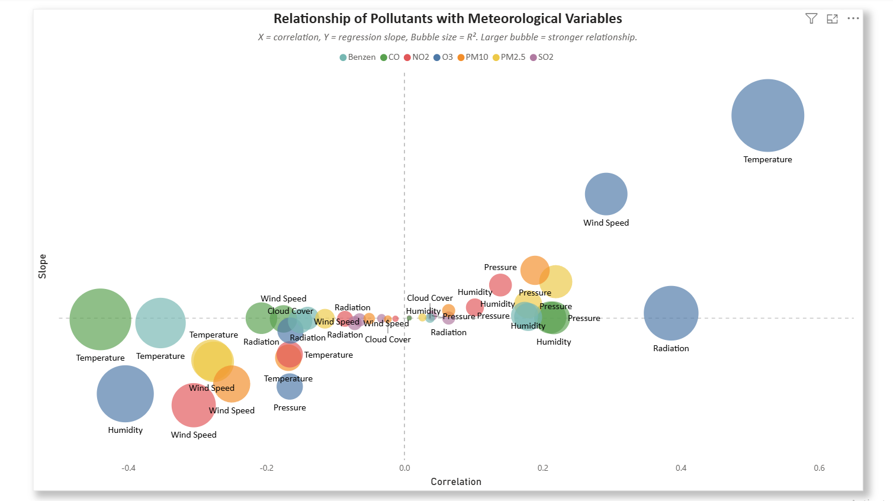
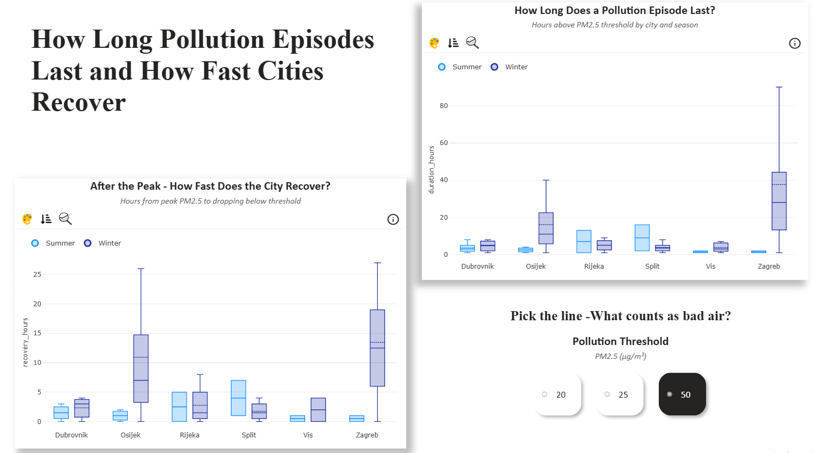
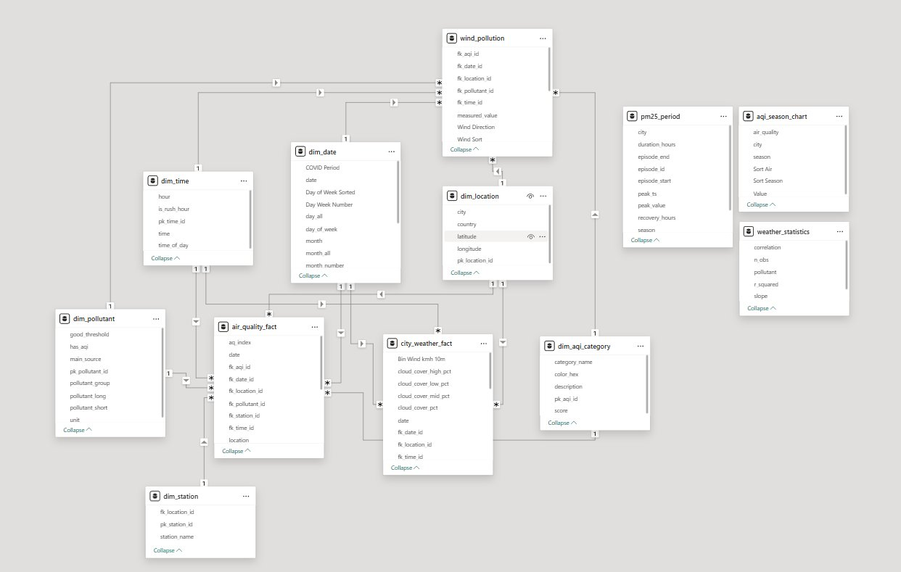

# Croatia Air Quality Analysis (2019–2025)

> ⚠️ Raw data files (~700MB) are not included due to GitHub size limits. All SQL scripts, DAX measures, dashboard exports, and documentation are fully available.

**End-to-end data analytics project:** raw CSV files → PostgreSQL galaxy schema → Power BI interactive dashboard

Analyzing 7 years of hourly air pollution and weather data across 6 Croatian cities to uncover when, where, and why air quality deteriorates.

![Dashboard Preview][Wind Rose](screenshots/06_wind_rose.png)

---

## Project Overview


This project transforms that raw data into an analytical platform that answers real questions:
- **Which cities have the worst air?** Zagreb and Osijek dominate — driven by winter heating and continental geography
- **When is it worst?** Winter months, weekday rush hours, and temperature inversions create pollution traps
- **What drives it?** Temperature has the strongest correlation with PM2.5 (r = -0.28) — cold air literally traps pollution at ground level
- **Did COVID change anything?** YES — NO₂ dropped during lockdown and never fully recovered, suggesting lasting behavioral shifts
- **How long do pollution episodes last?** Zagreb winter episodes average 40+ hours above WHO thresholds, with some exceeding 300 hours

## Dashboard Pages

| Page | What It Shows |
|------|--------------|
| **Seasonal Waterfall** | Side-by-side winter vs summer pollution "recipe" — which pollutants contribute most to bad air in each season |
| **Temporal Patterns** | Day-of-week deviations, COVID impact on NO₂, and percentage of hours spent breathing unhealthy air by season |
| **Heatmaps** | Matrix views: city × month, day × hour, and city × day-of-week showing AQI ratios — darker = worse air |
| **Weather Sensitivity** | Scatter plots of PM2.5 vs temperature, wind speed, and wind shear with correlation analysis |
| **Wind Rose** | Radar charts showing pollution levels and wind speed by cardinal direction — reveals which winds bring dirty air |
| **Bubble Chart** | All pollutant-weather correlations in one view: x = correlation, y = slope, bubble size = R² |
| **Survival Analysis** | Box plots of PM2.5 episode duration and city recovery time, with interactive threshold selector (20/25/50 µg/m³) |

### Dashboard Screenshots










---

## Architecture

```
  27 CSV files                    Open-Meteo API
  (Croatian Environment Agency)   (Weather data)
         │                              │
         ▼                              ▼
  ┌─────────────────────────────────────────┐
  │          PostgreSQL (Staging)            │
  │  27 station tables → UNION ALL          │
  │  CROSS JOIN LATERAL unpivot             │
  │  Date parsing (mixed DD.MM.YYYY /       │
  │    "Day, Month DD, YYYY" formats)       │
  │  Outlier cleaning + AQI classification  │
  └─────────────────┬───────────────────────┘
                    ▼
  ┌─────────────────────────────────────────┐
  │      PostgreSQL (Galaxy Schema)         │
  │                                         │
  │  air_quality_fact ─┬─ dim_date          │
  │     (~8M rows)     ├─ dim_time          │
  │                    ├─ dim_location       │
  │  city_weather_fact ├─ dim_station       │
  │     (~400K rows)   ├─ dim_pollutant     │
  │                    └─ dim_aqi_category  │
  │                                         │
  │  + Views: wind_pollution,               │
  │           aqi_exceedance_profile        │
  │  + Tables: weather_statistics,          │
  │            pm25_episodes                │
  └─────────────────┬───────────────────────┘
                    ▼
  ┌─────────────────────────────────────────┐
  │         Power BI (Import Mode)          │
  │  DAX measures + interactive dashboard   │
  └─────────────────────────────────────────┘
```

## Data Model

The database uses a **galaxy schema** (two fact tables sharing dimension tables):



**Fact Tables:**
- `air_quality_fact` — ~8 million rows of hourly pollutant measurements (7 pollutants × 19 stations × 6 years)
- `city_weather_fact` — ~400K rows of hourly weather observations (temperature, humidity, wind, pressure, cloud cover, radiation)

**Dimension Tables:**
- `dim_date` — calendar with season, day-of-week, week/month numbering, COVID period flag
- `dim_time` — 24 hours with time-of-day labels and rush hour flag
- `dim_location` — 6 cities with coordinates
- `dim_station` — 19 monitoring stations linked to cities
- `dim_pollutant` — 7 pollutants with EAQI thresholds, units, source descriptions
- `dim_aqi_category` — 5-level European AQI classification with color coding

**Analytical Tables (built in SQL):**
- `weather_statistics` — CORR() and REGR_SLOPE() for every pollutant × weather variable combination, with PERCENT_RANK() trimming to 1st–99th percentile
- `pm25_episodes` — gaps-and-islands window function analysis identifying continuous PM2.5 exceedance episodes, peak values, duration, and recovery time
- `wind_pollution` — cross-fact-table view joining air quality with wind direction data
- `aqi_exceedance_profile` — percentage of hours in each AQI category by city and season

---

## Tech Stack

| Layer | Technology | Key Techniques |
|-------|-----------|----------------|
| **Database** | PostgreSQL 16 | Galaxy schema, `CROSS JOIN LATERAL` unpivot, `CORR()` / `REGR_SLOPE()`, gaps-and-islands window functions, `PERCENT_RANK()` outlier trimming, `UNION ALL` across 27 tables |
| **BI Tool** | Power BI Desktop | DAX (CALCULATE, AVERAGEX, CROSSFILTER, SWITCH, iterators), Import mode, cross-fact-table measures, conditional formatting, custom AQI color scales |
| **Data Source** | Croatian Environment Agency CSVs + Open-Meteo API | Mixed date formats, 7 pollutants, 19 stations, 6 cities |
| **IDE** | VS Code + SQLTools | PostgreSQL extension for development |

---

## Repository Structure

```
croatia-air-quality/
│
├── README.md
├── .gitignore
│
├── sql/
│   ├── 01_schema_ddl.sql              -- Galaxy schema: all CREATE TABLE + indexes
│   ├── 02_etl_staging_and_load.sql    -- 27 staging tables + COPY commands
│   ├── 03_etl_transform.sql           -- UNION ALL, CROSS JOIN LATERAL unpivot,
│   │                                     date parsing, FK assignment, AQI classification,
│   │                                     outlier cleaning
│   ├── 04_analysis_views.sql          -- wind_pollution view, aqi_exceedance_profile
│   ├── 05_weather_sensitivity.sql     -- CORR/REGR_SLOPE analysis (raw + cleaned)
│   └── 06_pm25_survival_analysis.sql  -- Gaps-and-islands episode detection
│
├── dashboard/
│   ├── air_quality_analysis.pdf       -- Static PDF export of all pages
│   └── screenshots/                   -- Individual page screenshots
│
├── docs/
│   ├── data_dictionary.md             -- Every table and column documented
│   └── dax_measures.md                -- Key DAX measures with explanations
│
└── data/
    └── README.md                      -- Data source links (files not included due to size)
```

---

## Key SQL Highlights

### CROSS JOIN LATERAL — Unpivoting Wide to Long

The raw CSV files have one column per pollutant (wide format). The fact table needs one row per measurement (long format). `CROSS JOIN LATERAL` is the PostgreSQL way to do this efficiently:

```sql
CREATE TABLE air_quality_db.air_quality_all_unpivot AS
SELECT id, date, time, location, station, pollutant, measured_value
FROM air_quality_db.air_quality_all
CROSS JOIN LATERAL (
    VALUES
        ('benzen', benzen), ('co', co), ('no2', no2), ('o3', o3),
        ('pm10', pm10), ('pm25', pm25), ('so2', so2)
) AS unpivot (pollutant, measured_value);
```

### Gaps-and-Islands — PM2.5 Episode Detection

Identifying continuous pollution episodes requires detecting when consecutive hours stay above a threshold. The `LAG()` + cumulative `SUM()` pattern groups these into episodes:

```sql
-- Flag episode starts: gap > 1 hour between consecutive above-threshold readings
CASE 
    WHEN ts - LAG(ts) OVER (PARTITION BY city, threshold_ug ORDER BY ts) > INTERVAL '1 hour'
    OR LAG(ts) IS NULL
    THEN 1 ELSE 0 
END AS is_episode_start

-- Running sum of starts = episode ID
SUM(is_episode_start) OVER (PARTITION BY city, threshold_ug ORDER BY ts) AS episode_id
```

### Weather Correlation with Outlier Trimming

Raw correlations can be distorted by sensor errors. The analysis uses `PERCENT_RANK()` to trim the 1st and 99th percentiles before computing `CORR()` and `REGR_SLOPE()`:

```sql
WITH daily_avg AS (
    SELECT fk_date_id, fk_location_id, pollutant_short,
           AVG(measured_value) AS avg_pollution,
           AVG(temperature_2m_c) AS avg_temp, ...
    FROM air_quality_fact a
    JOIN city_weather_fact w ON a.fk_date_id = w.fk_date_id
        AND a.fk_location_id = w.fk_location_id AND a.fk_time_id = w.fk_time_id
    GROUP BY fk_date_id, fk_location_id, pollutant_short
),
cleaned AS (
    SELECT * FROM (
        SELECT *, PERCENT_RANK() OVER(PARTITION BY pollutant_short ORDER BY avg_pollution) AS pct_rank
        FROM daily_avg
    ) t WHERE pct_rank BETWEEN 0.01 AND 0.99
)
SELECT pollutant_short, 'temperature',
       CORR(avg_temp, avg_pollution)::DECIMAL(5,3),
       REGR_SLOPE(avg_pollution, avg_temp)::DECIMAL(10,4)
FROM cleaned GROUP BY pollutant_short;
```

---

## Key DAX Measures

```dax
// AQI Ratio — average measured value relative to the "Good" threshold
// Values > 1.0 mean the city exceeded the Good limit on average
Aqi Ratio = 
AVERAGEX(
    air_quality_fact,
    DIVIDE(
        air_quality_fact[measured_value],
        RELATED(dim_pollutant[good_threshold])
    )
)

// Day-of-week deviation — how much each day deviates from the weekly mean
// Positive = dirtier than average, negative = cleaner
Avg Measured Value / Day of Week = 
VAR DayAvg = AVERAGE(air_quality_fact[measured_value])
VAR WeekAvg = CALCULATE(
    AVERAGE(air_quality_fact[measured_value]),
    REMOVEFILTERS(dim_date[day_of_week])
)
RETURN DIVIDE(DayAvg - WeekAvg, WeekAvg) * 100

// Cross-fact-table measure using CROSSFILTER
// Enables joining air_quality_fact with city_weather_fact through shared dimensions
Avg PM25 for Weather = 
CALCULATE(
    AVERAGE(air_quality_fact[measured_value]),
    CROSSFILTER(city_weather_fact[fk_date_id], dim_date[pk_date_id], Both),
    air_quality_fact[pollutant] = "pm25"
)
```

---

## Data Sources

| Source | Description | Access |
|--------|------------|--------|
| **Croatian Environment Agency** | Hourly air quality measurements from 19 monitoring stations across Croatia (2019–2024) | [kvaliteta-zraka.hr](https://iszz.azo.hr/iskzl/podatakexp.htm) |
| **Open-Meteo Historical Weather API** | Hourly weather data (temperature, wind, humidity, pressure, cloud cover, radiation) for each city | [open-meteo.com](https://open-meteo.com/) |
| **European AQI** | Air quality index classification thresholds and categories | [European Environment Agency](https://www.eea.europa.eu/themes/air/air-quality-index) |

---

## Key Findings

1. **Zagreb and Osijek** consistently have the worst air quality, driven by continental climate (cold winters, low wind) and residential heating
2. **Winter is 2–4× worse than summer** across all inland cities — PM2.5 is the dominant winter pollutant, while O3 dominates summer
3. **Weekdays are dirtier than weekends** (CO and NO₂ deviate up to +8% on Fridays vs -18.6% on Sundays), confirming traffic as a major source
4. **COVID lockdown permanently reduced NO₂** — levels dropped in March 2020 and post-COVID (2021–2024) averages never returned to 2019 levels
5. **Temperature inversions trap pollution** — the negative correlation between temperature and PM2.5 (r = -0.28) reflects cold, stagnant air preventing pollutant dispersion
6. **Wind is the best natural cleaner** — higher wind speed consistently correlates with lower pollution across all pollutants
7. **Coastal cities (Dubrovnik, Split, Vis)** enjoy naturally cleaner air due to sea breezes and milder winters

---

## Author

**Duje** 

- This project demonstrates: data modeling (galaxy schema), ETL pipeline design, advanced SQL (window functions, statistical aggregates, cross-joins), DAX development, and dashboard storytelling
- Built from scratch over several months as a portfolio project

---

*Built with PostgreSQL 16, Power BI Desktop, and VS Code*
